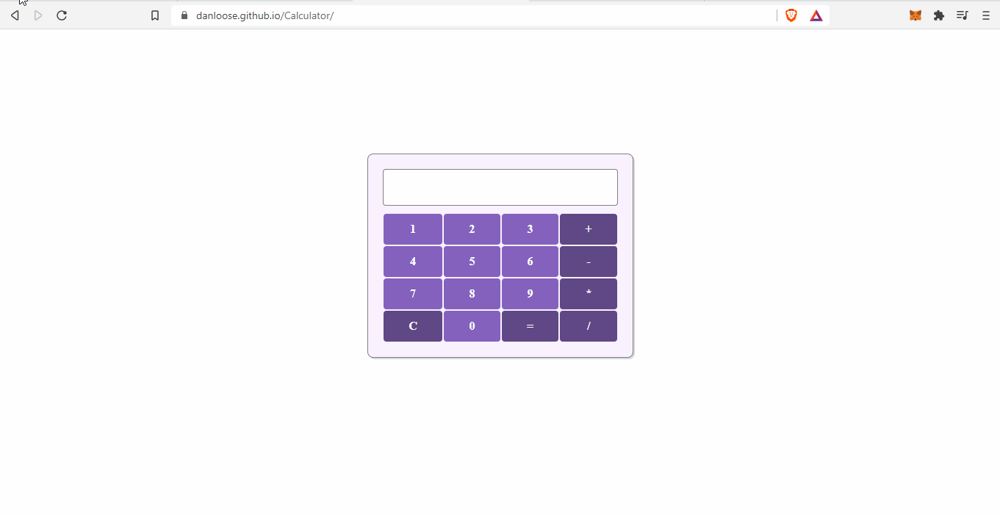

# Calculator
-> https://danloose.github.io/Calculator//

Calculator é um projeto que tenho aprimorado a medida que avanço nos meus estudos. Há alguns bugs como clicar em sinais de operação (como + e depois - e depois outro qualquer) que causam
algum tipo de erro na calculadora. Acredito que isso aconteça pelo uso da função Eval( ), que atualmente é a responsável por receber as strings e gerar o resultado matemático que será
impresso no console.

Futuras Implementações:  
-> Operações com números fracionados   
-> Raízes e Potências  
-> Dark Mode 
-> Implementações visuais 
->  
-> Considere deixar a sua sugestão! :)     

